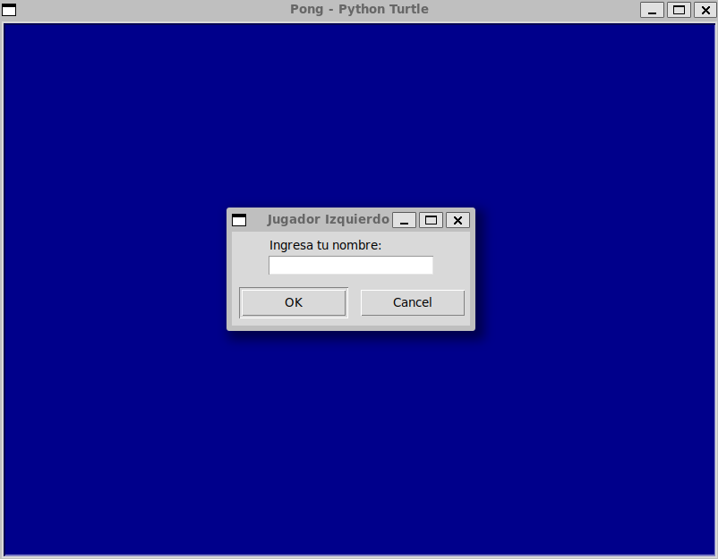
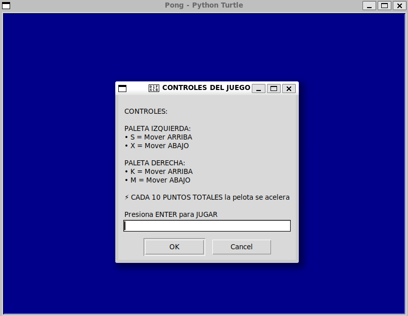
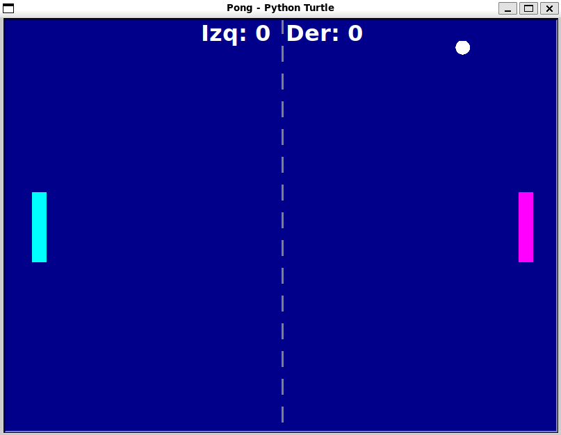

# Pong Game - Python Turtle

## 🧩Descripción del proyecto

Juego Arcade Pong implementado con Python Turtle para dos jugadores. Incluye:
- Nombres personalizados para jugadores 
- Instrucciones interactivas al inicio
- Velocidad que aumenta cada 10 puntos totales
- Paletas con colores distintivos (cian y magenta)
---

## ⚙️ Configuración del ambiente

#### 1. Clonar el repositorio (opcional)

#### 2. Crear el entorno virtual: (opcional)
- python -m venv venv 
o
- python3 -m venv venv

#### 3. Activar el entorno virtual:
en Windows:

- venv\Scripts\activate

en linux:
- source venv/bin/activate

#### 4. Ejecución del script
- python main.py 
o
- python3 main.py

---
## 🎮Controles
| Jugador   | Tecla | Acción   |
| --------- | ----- | -------- |
| Izquierda | S     | ↑ Arriba |
| Izquierda | X     | ↓ Abajo  |
| Derecha   | K     | ↑ Arriba |
| Derecha   | M     | ↓ Abajo  |

---

## 🏗️Requisitos

- Python 3.6+  
- Módulo turtle (incluido por defecto)  
 

---

## 📸 Capturas de Pantalla

---
## ✍️ Autoría y comunidad
Este proyecto forma parte de mi proceso de aprendizaje en desarrollo fullstack, adicionalmente está pensado para compartir con la comunidad (Conquer o quien lo necesite).

Si te sirve:
- Puedes abrir Issues con dudas o mejoras.
- Puedes hacer Pull Requests con mejoras al script, documentación, etc
- Sugerencias de contribución:
    - Sistema de victorias (primero a 20 puntos)
    - Efectos de sonido
    - IA para jugador único
    - Tema oscuro/claro

Hecho con ❤️‍🔥 para el Máster Full Stack en ConquerBlocks

<!-- Python --> 

 

